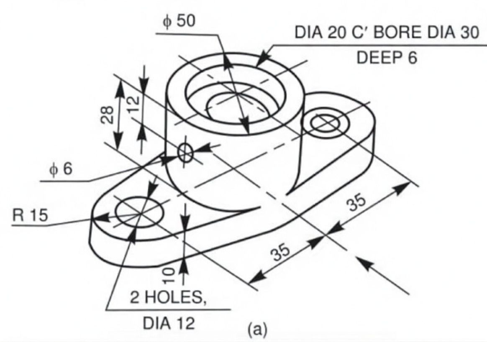
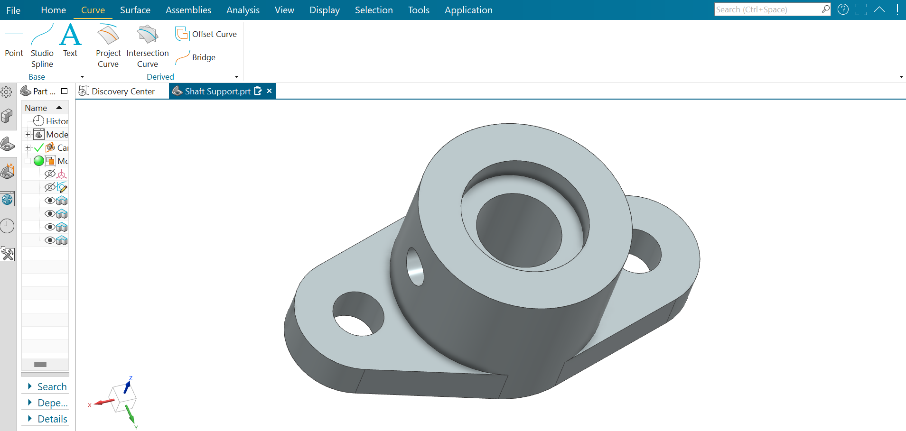
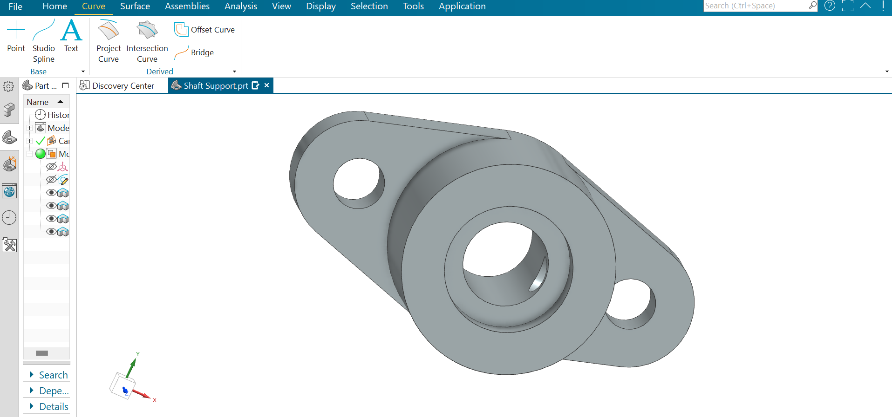
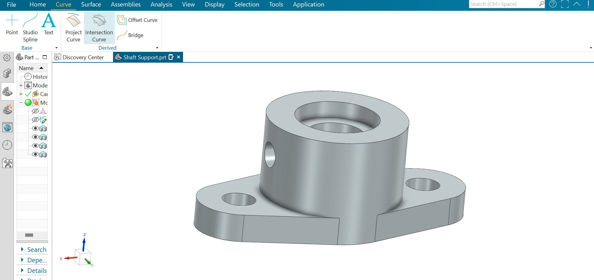
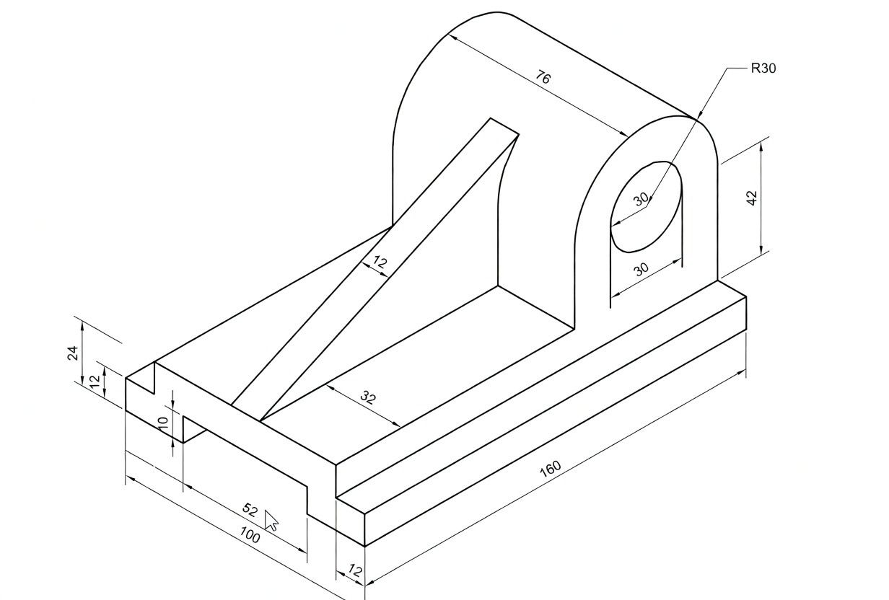
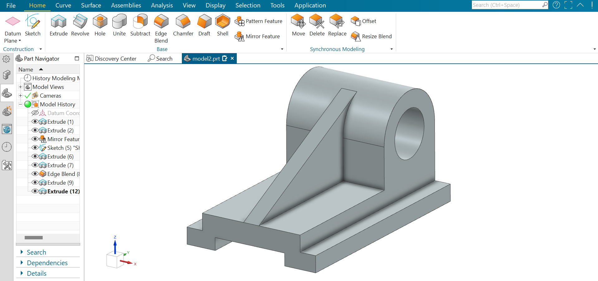
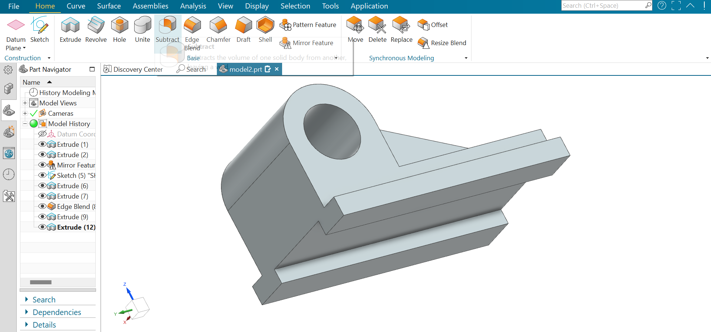
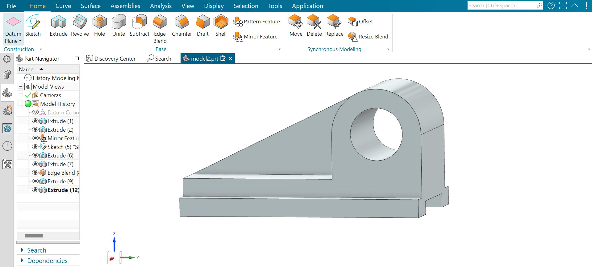

# 🚀 SIEMENS NX

# Dual-Radius Pipe Support Clamp — Siemens NX CAD Model 

## 📖 Overview
This project models a pipe support clamp with integrated base plate, fully created in Siemens NX. The component demonstrates key NX workflows including sketch-based extrusion, revolve for cylindrical features, swept cut for slot creation, edge blending (fillets), and precise dimension-driven modeling from an engineering drawing.

## 🎯 Objective
Accurately recreate the pipe clamp/support component from the provided technical drawing while ensuring clean, manufacture-ready geometry suitable for machining or casting. This type of part is commonly used to secure pipes, tubes or hoses in industrial, automotive, marine, and machinery applications.

## ⚙️ Specifications & Commands

| **Design Specifications**          | **Siemens NX Commands / Features Demonstrated** |
|------------------------------------|-------------------------------------------------|
| Total length: 118 mm               | Sketch → Extrude                                |
| Base width: 48 mm                  | Revolve                                         |
| Clamp inner diameters: Ø20 mm & Ø12 mm | Swept Cut (for elongated slot)              |
| Base slot: 44 × 16 mm rounded rectangle | Pattern (rectangular if needed)             |
| Height (clamp top): 40 mm          | Edge Blend (fillet R2)                          |
| Material thickness (main body): 16 mm | Datum features / Constraints                 |
| Fillet radius: R2 mm               | Synchronous / Ordered modeling                  |
| Units: Millimeters (mm)            | 2D Sketching with dimensions & relations        |

## ✨ Design Features
- Dual semi-circular clamp sections for different pipe diameters  
- Elongated mounting slot in base for positional adjustment  
- Reinforced transition geometry between clamp and base  
- Uniform wall thickness suitable for casting or machining  
- Rounded edges (R2) for safety and improved manufacturability  

## 📐 Technical Drawing Source
Model was built directly from the following 2D information visible in the isometric view:
- All principal linear dimensions  
- Cylinder diameters and heights  
- Slot length, width and fillet radii  
- Centerline references  
- Fillet callouts (R2)  

## 📸 Models / Screenshots

## 📥 CAD Downloads

stl (for 3D printing / visualization)  

Download the file here:  
[Download Pipe Support Clamp archive](./siemennxassets/Dual-Radius%20Pipe%20Support%20Clamp.zip)

## 🏭🔩 Manufacturing Considerations
Recommended production methods:

- CNC machining from aluminum or steel block (most common)  
- Casting (sand or investment) + light machining of mating surfaces  
- Plasma / laser cutting of base plate + welded clamp sections (fabrication alternative)  

Design supports:
- Standard M10–M12 bolts through elongated slot  
- Easy deburring thanks to R2 external fillets  
- Good fixturing surfaces for machining  

## 🌐 Applications
Typical real-world use cases:

- Industrial pipe and tube routing systems  
- Hydraulic & pneumatic line clamping  
- Automotive chassis / engine bay supports  
- Marine & offshore equipment  
- HVAC installations  
- Machinery frames & conveyor systems  

## 💭 Reflection
This Siemens NX project helped demonstrate:

- Reading and interpreting complex isometric drawings with many dimensions  
- Effective use of revolve and sweep features for curved geometry  
- Maintaining design intent through fully dimensioned sketches  
- Application of edge blending for realistic engineering parts  
- Clean model structure suitable for downstream manufacturing or assembly use  

Possible future enhancements:

- Add threaded holes or clearance holes for specific bolt sizes  
- Apply GD&T (datums, position, profile tolerances)  
- Create proper 2D drawing sheet inside NX with views & annotations  
- Add material and mass properties  
- Perform basic FEA (stress on clamp under load)  
- Create a small assembly with sample pipe + bolts  

Feedback and suggestions welcome! 💬

# Shaft Support Bracket — Siemens NX CAD Model 

## 📖 Overview
This project models a shaft support bracket (pedestal / pillow-block style) with counterbored saddle, fully created in Siemens NX. The component demonstrates key NX workflows including sketch-based extrusion, revolve for the main cylindrical feature, pocket/counterbore, simple hole features, large edge blending (R15), and precise dimension-driven modeling from an engineering drawing.

## 🎯 Objective
Accurately recreate the shaft support component from the provided technical drawing while ensuring clean, manufacture-ready geometry suitable for machining, casting or 3D printing prototypes. This type of bracket is commonly used to support shaft ends, rollers or light-duty bearings in machinery, conveyors, agricultural equipment and test rigs.

## ⚙️ Specifications & Commands

| **Design Specifications**          | **Siemens NX Commands / Features Demonstrated** |
|------------------------------------|-------------------------------------------------|
| Overall length (base) ≈ 118 mm     | Sketch → Extrude                                |
| Base width ≈ 48 mm                 | Revolve                                         |
| Main bore Ø20 mm through           | Pocket / Counterbore (Ø30 × deep 6)             |
| Counterbore Ø30 × deep 6 mm        | Hole feature                                    |
| Mounting holes: 2 × Ø12 mm         | Extrude cut / Swept cut (elongated slots)       |
| Elongated slots ≈ 35 × 12 mm       | Pattern (if needed)                             |
| Outer saddle diameter Ø50 mm       | Edge Blend (R15 main + smaller fillets)         |
| Height to centerline ≈ 28 mm       | Datum features / Constraints                    |
| Main transition radius R15         | Synchronous / Ordered modeling                  |
| Cross hole Ø6 mm                   | 2D Sketching with dimensions & relations        |
| Units: Millimeters (mm)            |                                                 |

## ✨ Design Features
- Counterbored semi-circular saddle (Ø20 through + Ø30 × 6 mm deep recess)  
- Two elongated mounting slots in base for adjustment  
- Reinforced transition geometry with large R15 fillets  
- Ø6 cross-drilled hole (grease, pin or lock-wire feature)  
- Uniform wall thickness suitable for casting or machining  
- Rounded edges for safety and improved manufacturability  

## 📐 Technical Drawing Source
Model was built directly from the following 2D information visible in the isometric view:
- All principal linear dimensions  
- Cylinder diameters and depths  
- Slot lengths, widths and hole sizes  
- Centerline references  
- Fillet callouts (R15)  

## 📸 Models / Screenshots

  
  
  
  

## 📥 CAD Downloads

stl (for 3D printing / visualization)  

Download the file here:  
[Download Shaft Support Bracket archive](./siemennxassets/Shaft%20Support.zip)

## 🏭🔩 Manufacturing Considerations
Recommended production methods:

- CNC machining from aluminum or steel block (most common)  
- Casting (sand or investment) + light machining of bore and base  
- Fabrication alternative: cut base plate + welded saddle (less precise)  

Design supports:
- Standard M10–M12 bolts through elongated slots  
- Easy deburring thanks to rounded edges  
- Good fixturing surfaces for machining  

## 🌐 Applications
Typical real-world use cases:

- Shaft end support in conveyors, fans, gearboxes  
- Light-duty bearing housings  
- Agricultural machinery rollers  
- Test rigs and prototype machines  
- Small automation frames  
- DIY mechanical projects  

## 💭 Reflection
This Siemens NX project helped demonstrate:

- Reading and interpreting complex isometric drawings with many dimensions  
- Effective use of revolve and pocket features for counterbored geometry  
- Maintaining design intent through fully dimensioned sketches  
- Application of large structural fillets (R15) for strength  
- Clean model structure suitable for downstream manufacturing or assembly use  

Possible future enhancements:

- Add set screw or locking features  
- Apply GD&T (concentricity on bore, position on holes)  
- Create proper 2D drawing sheet inside NX with views & annotations  
- Add material and mass properties  
- Perform basic FEA (load on shaft → stress in bracket)  
- Create a small assembly with sample shaft + bolts  

Feedback and suggestions welcome! 💬

# 🚀 SIEMENS NX

# Bearing Bracket — Siemens NX CAD Model 

## 📖 Overview
This project models a bearing bracket with curved saddle and reinforced angled support, fully created in Siemens NX. The component demonstrates key NX workflows including sketch-based extrusion for the base and brace, revolve for the semi-circular saddle, swept or pocket cuts for the U-opening, large edge blending (R30), and precise dimension-driven modeling from an engineering drawing.

## 🎯 Objective
Accurately recreate the bearing support bracket from the provided technical drawing while ensuring clean, manufacture-ready geometry suitable for machining, casting or 3D printing prototypes. This type of bracket is commonly used to support bearings, bushings or shafts in machinery frames, conveyors, agricultural implements and structural assemblies.

## ⚙️ Specifications & Commands

| **Design Specifications**          | **Siemens NX Commands / Features Demonstrated** |
|------------------------------------|-------------------------------------------------|
| Overall base length 160 mm         | Sketch → Extrude                                |
| Base width 100 mm (main) + 52 mm step | Revolve (saddle arc)                         |
| Saddle inner radius R30 (Ø60 bore) | Pocket / Subtract for U-opening                |
| Saddle height 42 mm                | Extrude (angled brace)                         |
| Angled brace thickness 12 mm       | Sweep or Extrude cut (openings)                |
| Brace length ≈76 mm                | Edge Blend (R30 main + smaller fillets)        |
| Base height stepped: 24 mm / 12 mm | Datum features / Constraints                   |
| U-opening width 30 mm              | Synchronous / Ordered modeling                 |
| Main fillet R30                    | 2D Sketching with dimensions & relations       |
| Units: Millimeters (mm)            |                                                 |

## ✨ Design Features
- Large semi-circular saddle with R30 inner radius (suitable for Ø60 shaft or bearing OD)  
- Open U-shaped design for easy shaft insertion / removal  
- Angled reinforcing brace (12 mm thick) connecting saddle to base  
- Stepped base with 100 mm main section + 52 mm extended / lowered section  
- Uniform material thickness suitable for casting or machining  
- Large R30 external fillet for strength and stress reduction  

## 📐 Technical Drawing Source
Model was built directly from the following 2D information visible in the isometric view:
- All principal linear dimensions  
- Arc radius and saddle dimensions  
- Brace angles and thicknesses  
- Base step heights and lengths  
- Fillet callouts (R30)  

## 📸 Models / Screenshots

  
  
  
  

## 📥 CAD Downloads

stl (for 3D printing / visualization)  

Download the file here:  
[Download Bearing Bracket archive](./siemennxassets/Bearing%20Bracket.zip)

## 🏭🔩 Manufacturing Considerations
Recommended production methods:

- CNC machining from aluminum or steel block (most common)  
- Casting (sand or investment) + light machining of saddle surface  
- Fabrication alternative: plasma/laser cut plates + welded saddle (less precise)  

Design supports:
- Easy shaft / bearing installation via open U-shape  
- Good fixturing on large base surfaces  
- R30 transitions reduce stress concentrations under load  

## 🌐 Applications
Typical real-world use cases:

- Bearing or bushing supports in machinery frames  
- Conveyor roller end supports  
- Agricultural equipment (plows, harvesters)  
- Structural shaft mounts  
- Prototype test rigs  
- Industrial equipment frames  

## 💭 Reflection
This Siemens NX project helped demonstrate:

- Reading and interpreting isometric drawings with angled features  
- Effective use of revolve and subtract for curved open saddles  
- Creating strong angled brace geometry with consistent thickness  
- Application of large structural fillets (R30) for realistic strength  
- Clean model structure suitable for downstream manufacturing or assembly use  

Possible future enhancements:

- Add mounting holes or slots in the base  
- Include precise bearing seat features  
- Apply GD&T (concentricity on saddle, flatness on base)  
- Create proper 2D drawing sheet inside NX with views & annotations  
- Add material and mass properties  
- Perform basic FEA (bearing load → stress in bracket)  
- Create a small assembly with sample shaft + bearing  

Feedback and suggestions welcome! 💬
